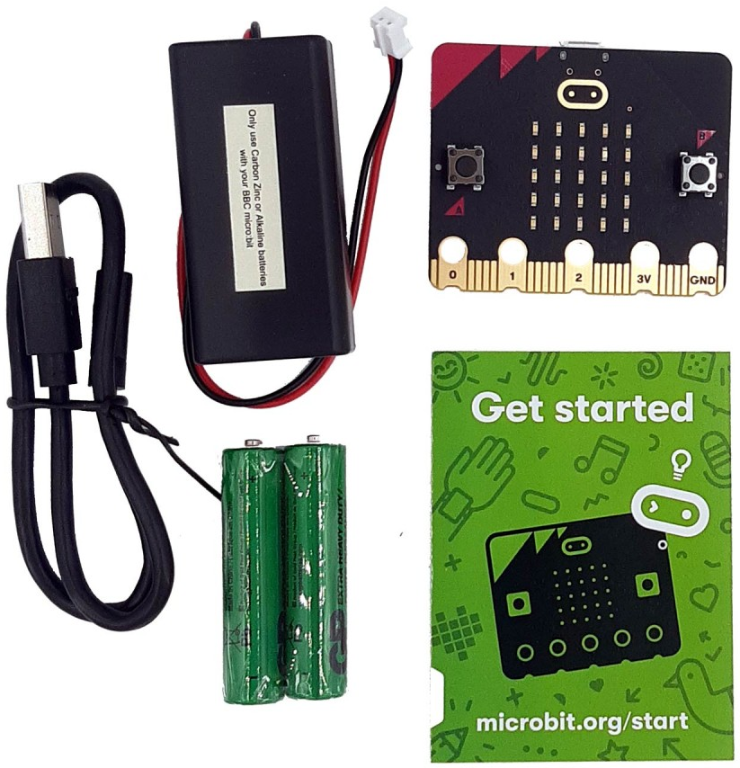
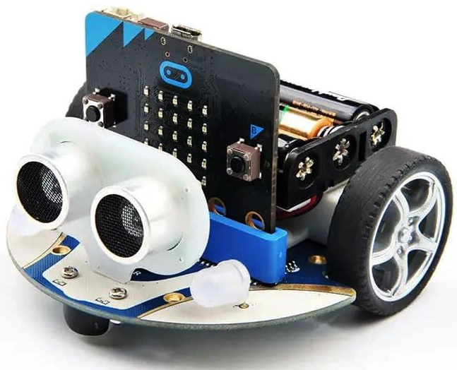
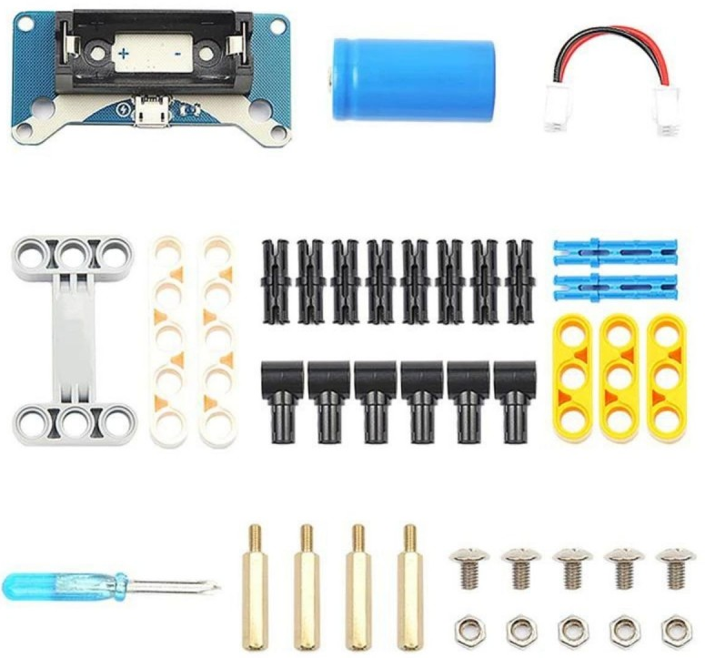
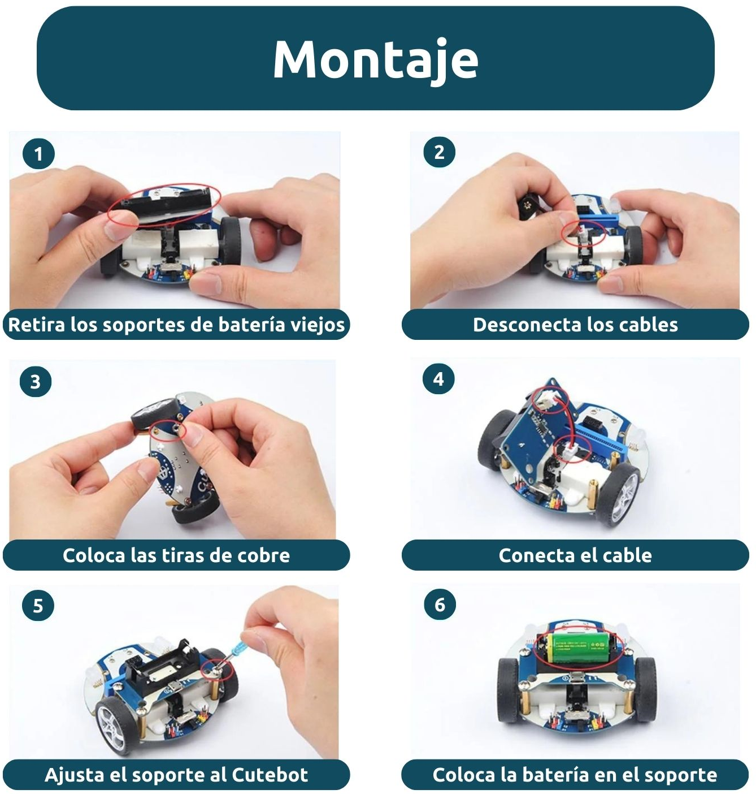

# 🧠 Tutorial Básico: Usar micro:bit con Cutebot de Elecfreaks

---
## 📦 ¿Qué necesitas?

- 1x **micro:bit V2** 
- 1x **Cutebot de Elecfreaks** 
- 1x **Cable USB**
- 1x **Batería o pack de pilas (2x 3.7V 18650 o 4x AAA con soporte)**
- 1x **Computadora con acceso a Internet**
- Acceso a [MakeCode](https://makecode.microbit.org/)

---
## micro:bit



---
- BBC Micro:Bit v2.2
- Procesador: 64 MHz Arm Cortex-M4 con FPU
- 512KB Flash + 128KB RAM
- 5x5 Red LED Array
- 2 pulsadores programables y logo táctil
- Micrófono MEMS e indicador LED +  Altavoz.
- Sensor de luz, brújula, acelerómetro, temperatura y micrófono.
- Radio 2.4 Ghz + Bluietooth BLE
- Conector de 25 Pines GPIO, PWM, I2C, SPI y alimentación
- 3 conexiones digital/analogico, entrada/salida
- Programable con C++, MakeCode, Python, Scratch

---

## Paso 0: recordando la programación de micro:bit

1. Ve a 👉 [https://makecode.microbit.org](https://makecode.microbit.org)
2. Clic en **“New Project”** (Nuevo Proyecto)
3. Ejemplo: "Emoticonos con botones"
4. Ejemplo: "Dado"

---

## 🧰 Paso 1: Montaje del Cutebot

1. **Inserta la micro:bit** en el zócalo superior del Cutebot (alineando los pines con cuidado).
2. **Conecta la batería** o alimenta con cable USB.  
3. Asegúrate de que el botón de encendido esté en "ON".


---
## Nuestro rover: Robot Cutebot


- Sensor de Ultrasonidos + Sigue-líneas + Sensor de IR
- Zumbador
- 2 x LEDs RGB
- 2 x LED Neopixel (debajo del chasis)
- 2 x Motores de 300 RPM
---

## Batería Lipo para CuteBot: la importancia de la energía

* ¿Por qué no utilizamos pilas en nuestro MoonCamp?
* Si usamos baterías ¿cómo las recargamos?


---



---
## 💻 Paso 2: Configurar entorno de programación (MakeCode)

1. Ve a 👉 [https://makecode.microbit.org](https://makecode.microbit.org)
2. Clic en **“New Project”** (Nuevo Proyecto)
3. Dale un nombre: `cutebot-proyecto`
4. Para usar funciones del Cutebot, añade el paquete de extensión:
    - Haz clic en el ícono de engranaje ⚙️ > **“Extensions”**
    - Busca: `cutebot`
    - Selecciona el paquete **"Cutebot - ELECFREAKS"** (de elecfreaks)

---

## ⚙️ Paso 3: Conocer los bloques básicos del Cutebot

Una vez agregada la extensión, verás la nueva categoría `Cutebot` en el menú. Algunos bloques útiles:

|Bloque|Función|
|---|---|
|`cutebot.motors(velIzq, velDer)`|Controla ambos motores (de -100 a 100)|
|`cutebot.rgbLED(RGBEnum, R, G, B)`|Cambia color de luces RGB|
|`cutebot.readUltrasonic(Distance_Unit)`|Mide distancia con sensor ultrasónico|
|`cutebot.setServo(servo, grado)`|Controla servo externo|
|`cutebot.setIR(IRvalue)`|Controla receptor infrarrojo|

---

## 🚗 Paso 4: Actividad 1 – Movimientos básicos

### Objetivo: Mover el Cutebot hacia adelante por 2 segundos y detenerse.

```blocks
input.onButtonPressed(Button.A, function () {
    cutebot.motors(50, 50)
    basic.pause(2000)
    cutebot.motors(0, 0)
})
```

### Explicación:

- Al presionar el botón A en la micro:bit, los motores se activan con potencia 50.
- Espera 2 segundos.
- Luego se detienen.

---

## 💡 Actividad 2 – Evitar obstáculos con sensor ultrasónico

### Objetivo: Detectar objetos y retroceder si algo está a menos de 10 cm.

```blocks
basic.forever(function () {
    if (cutebot.readUltrasonic(Distance_Unit.cm) < 10) {
        cutebot.motors(-50, -50)
        basic.pause(500)
        cutebot.motors(50, -50) // gira
        basic.pause(400)
    } else {
        cutebot.motors(50, 50)
    }
})
```

---

## 🌈 Actividad 3 – Luces RGB al estilo policía 🚔

```blocks
basic.forever(function () {
    cutebot.rgbLED(cutebot.RGBLights.RGB_L, 255, 0, 0) // rojo izquierda
    cutebot.rgbLED(cutebot.RGBLights.RGB_R, 0, 0, 255) // azul derecha
    basic.pause(300)
    cutebot.rgbLED(cutebot.RGBLights.RGB_L, 0, 0, 255)
    cutebot.rgbLED(cutebot.RGBLights.RGB_R, 255, 0, 0)
    basic.pause(300)
})
```

---

## 🔄 Actividad 4 – Seguidor de línea (líneas negras sobre fondo blanco)

Cutebot tiene sensores IR para seguir líneas en la parte inferior.

```blocks
basic.forever(function () {
    if (cutebot.readPatrol(cutebot.Patrol.L1) == 0 && cutebot.readPatrol(cutebot.Patrol.R1) == 0) {
        cutebot.motors(50, 50)
    } else if (cutebot.readPatrol(cutebot.Patrol.L1) == 1) {
        cutebot.motors(0, 50)
    } else if (cutebot.readPatrol(cutebot.Patrol.R1) == 1) {
        cutebot.motors(50, 0)
    }
})
```

---

## 🔧 Tips adicionales

- **Velocidad:** Puedes cambiar los valores entre -100 a 100 para ajustar velocidad y dirección. Te sorprenderá la potencia de la batería Lipo.
- **Sensores:** Usa el sensor ultrasónico para juegos de evitación o conteo.
- **Luces:** Ideal para efectos visuales o alertas.
- **Servos:** Puedes añadir servos externos a los puertos laterales.

---

## 📚 Recursos adicionales

- [Manual oficial del Cutebot](https://www.elecfreaks.com/learn-en/microbit/kit/smart_cutebot/)    
